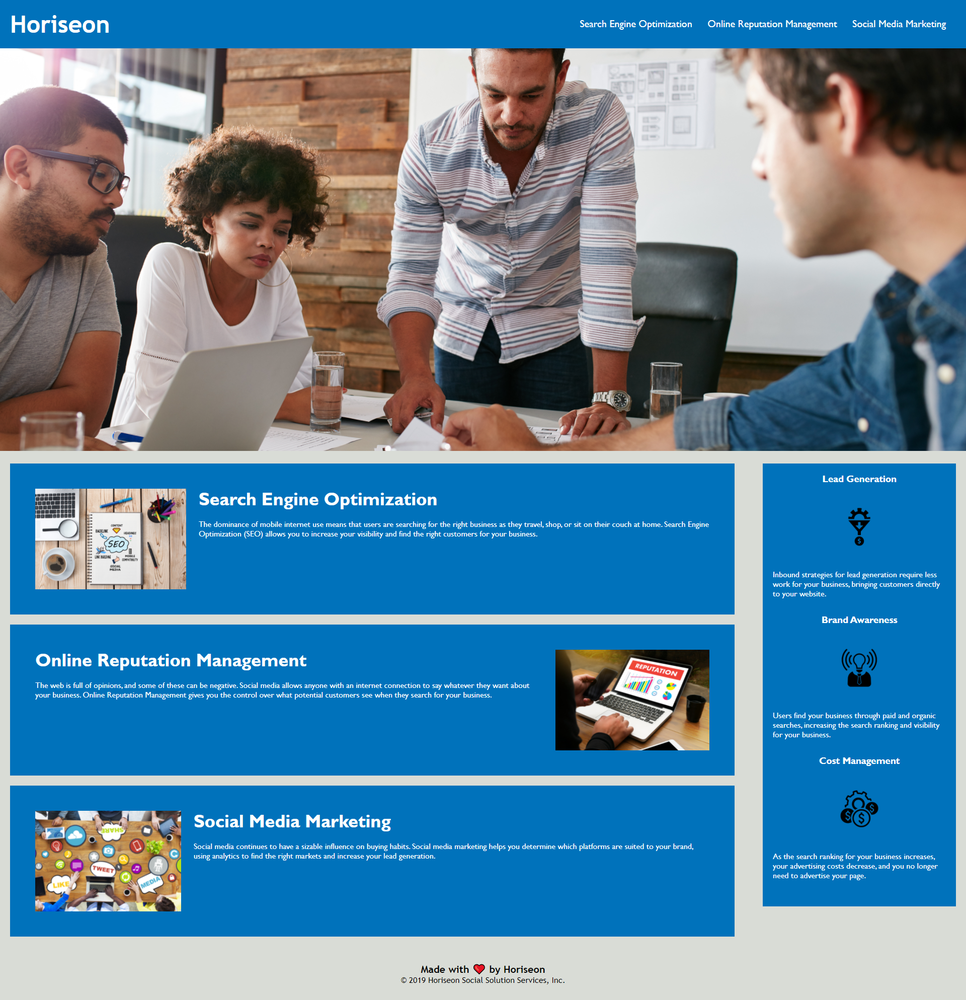

# week-1-homework

## Description

This is my week 1 homework assignment that involved refactoring a webpage. This included restructuring an already existing page to follow semantic HTML elements, ensuring all links work, adjust styling for a better user experience, adjusting the CSS file for a more consolidated and clean layout, and following the acceptance criteria provided to me.

## What I changed

I began by changing tags (majority being div tags) to more semantic elements including header, footer, aside, section, figure, and nav tags. I added ID tag so the page would redirect down to that specific spot on the webpage as well as provided alt tags to all 3 images within the article. In CSS I consolidated certain classes that all had the same styling elements so it just listed the class indentifiers in a row and 1 bracket with style elements instead of seperate classses and brackets. I altered the background colors to match for all parts of the page. I also removed a class in css that related to a span element and removed the span element. And I lastly just added spaces between elements for more clarity and readability of the code.

## Finished Product

Here is a screenshot and link to the finished webpage after refactoring:
[Link to webpage](https://phalenh.github.io/refactoring-html-project/Main/index.html)

